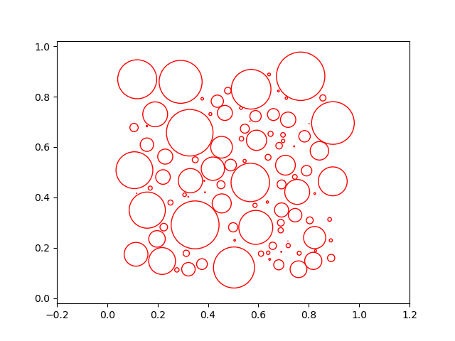
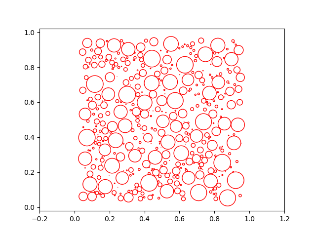

## Multi-Class Disk Distributions
This is an unofficial [Taichi](https://github.com/taichi-dev/taichi) implementation of ["Accurate Synthesis of Multi-Class Disk Distributions"](https://hal.inria.fr/hal-02064699/file/Accurate_Synthesis_of_Multi_Class_Disk_Distributions%20%281%29.pdf) [EG 2019].

### Prerequisite
```
[Taichi] version 0.7.10, llvm 10.0.0, commit 0f0205fc, osx, python 3.7.10
[Taichi] Starting on arch=x64
```

<!-- ### Structure
* ```pure_cpp```: forked from [here](https://github.com/Helios77760/ASMCDD), but remove all opengl stuff to a pure cpp version, super simple to run.
* ```simpler_cpp```: an even simpler version compared with ```pure_cpp```, still improving.
* ```python```: a python/pytorch implementation from scratch, still working

### How to run C++:
* Compile
```
cd simpler_cpp
mkdir build
cd build
cmake ..
make
```

* Run a single scene:
```
./DiskProject ../configs/constrained.txt
```

* Run all scenes
```
../scripts/run_all.sh
```


### How to run Python:
```
cd python
python main.py
```
 -->

### How to run:
```
cd taichi
python main.py --config_filename=configs/zerg_rush.txt
```


### Sample results:

Input                      |  Synthesized
:-------------------------:|:-------------------------:
  |  


### Reference
* [Unofficial C++ implementation](https://github.com/Helios77760/ASMCDD)


